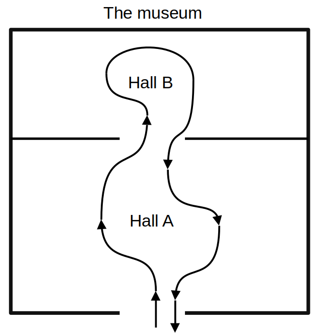

# The museum - a concurrent programming project
This was a project for the Operating systems with concurrency programming course.
## Introduction

    

The museum has 2 halls - A and B with limited capacity and _CA > CB_. Some of the visitors want to go to the A hall and leave, others want to visit both exhibitions. This environment was used to formulate two problems:
1. Maximize the number of visitors who visit the museum at the same time.
2. Allow people from hall B to leave the museum as fast as possible.
## Solution
### Problem 1
My take on the first problem was to allow the visitors to fill hall B while always leaving one spot free in hall A. This solution prevents deadlock that could occur when the visitors are trying to fill the full hall B while maximizing the number of visitors who visit the museum simultaneously. The implementation of this solution is based on the following idea:
1. Counting semaphores _sem.A_ and _sem.B_ initialized with respectively _CA-1_ and _CB_ are used to control the number of visitors who can enter the specific hall.
2. A mutex _mutex.B_ is used to allow only one visitor to leave hall B at a time.
### Problem 2
For the second problem, the solution is to reserve empty spots in hall A to allow the visitors to leave hall B as fast as possible. I implemented this solution by using two semaphores _sem.A_ and _sem.B_ initialized with respectively _CA_ and _CB_.
